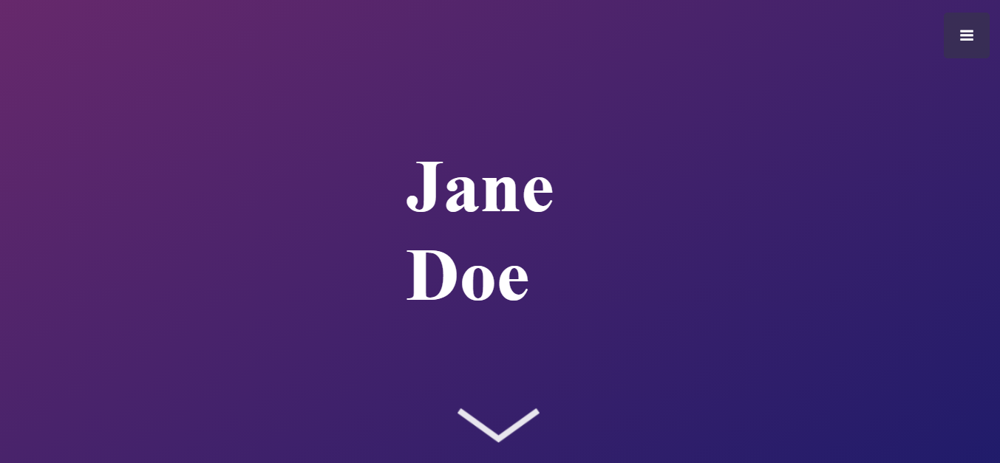

# HTML/CSS & JAVASCRIPT Portfolio Website Template

TOOLS USED: 

  

<b> <a href="https://lauratoro.art/demos/portfolio-template.html"> View Live Demo <a><b>
  
A design I used for my first website ever featuring a really cool name animation when you first open the site.

## Description
This is a very simple website for beginners who are just starting out with HTML & CSS. Can be easily edited and a great tool for expirementing and learning.

## Sections:
  
- 🙂 About me: also has a button to link to your resume (or anything)
- 🎓 Education
- 💻 Skillset: Featuring a Boostrap Flush Accordian <a href="https://getbootstrap.com/docs/5.0/components/accordion/"> more here. <a><b>
- 📝 Past works Design Carousel
- 💼 Personal projects: from the original design template. Credits below.
- 👍Contact: Simple banner with buttons. 
  

## Credits
##### Portfolio Tempplate
<a href="https://startbootstrap.com/theme/stylish-portfolio">Stylish Portfolio - A Free Bootstrap Theme by Start Bootstrap</a>

#### Name Animation Tutorial
<a href="https://alvaromontoro.com/blog/67836/recreating-the-ipad-commercial-animation-with-css">Recreating the iPad Commercial Animation with CSS</a>

##### Animation Gradient Background
<a href="https://www.gradient-animator.com/">CSS GRADIENT ANIMATOR by Ian Forrest</a>
